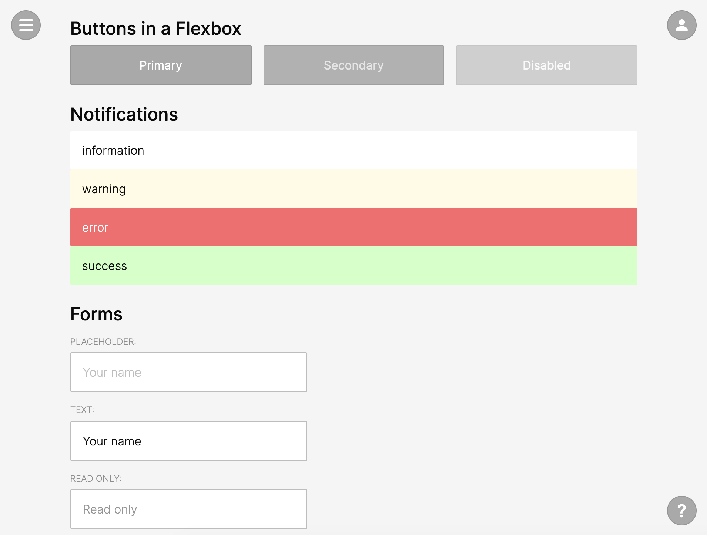

# Aether CSS framework

**Simple, Interactive, Fun, Beautiful CSS system**

Demo: https://tomsoderlund.github.io/aether-css/

## Design goals

- A good starting point for any web/mobile/PWA project.
- Avoid weird classes* as much as possible, just use element names.
- Easy to customize (“themeable”). Examples:
  - Change the color of button, and hover states are automatically updated (they use `filter`).
  - Borders use transparency.
- Use the [Three Zone Navigation System](https://medium.com/@tomsoderlund/three-zone-navigation-system-45f20d08bed4).
- Clear interaction states for buttons etc.
- Lightweight (somewhat).
- Compatible (somewhat).

*Exceptions: `.fieldset` (because of `fieldset` flexbox bug), `.tag` (tags/tokens), `.flex` (flexbox container for columns etc).

## Todo

- Code

## Install

    yarn add aether-css-framework

## Import in JavaScript

    import '../node_modules/aether-css/dist/aether.min.css'

And use the [“Inter” font](https://rsms.me/inter/):

    <link href="https://fonts.googleapis.com/css2?family=Inter:wght@300;400;500&display=swap" rel="stylesheet">
